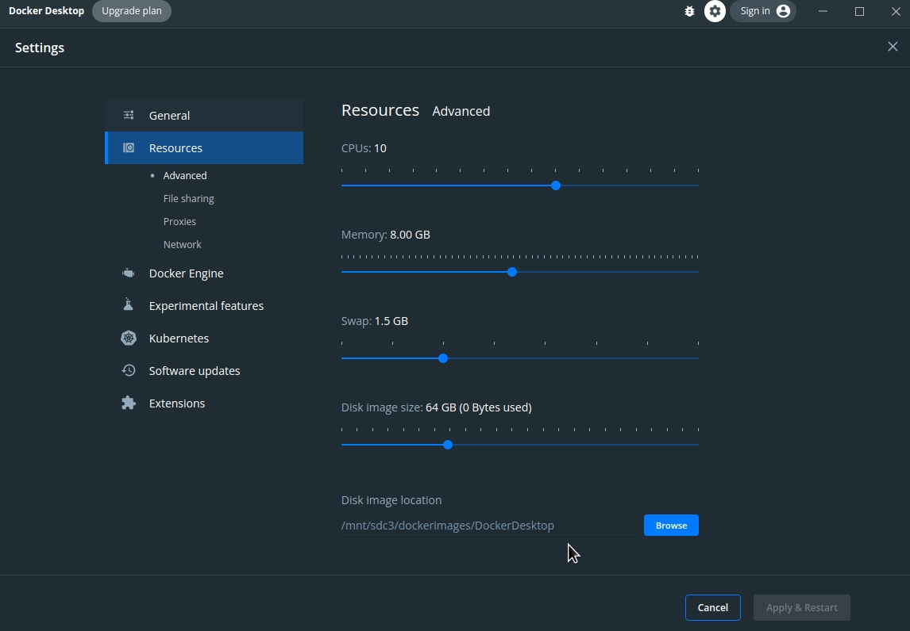
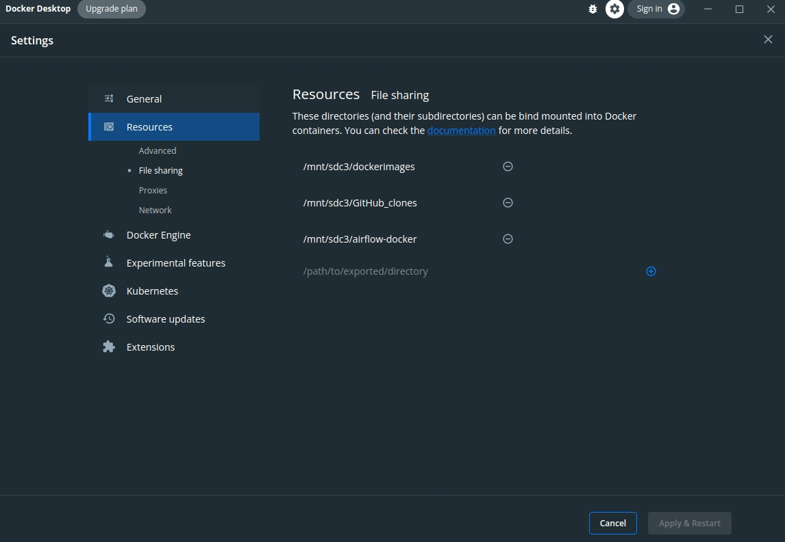
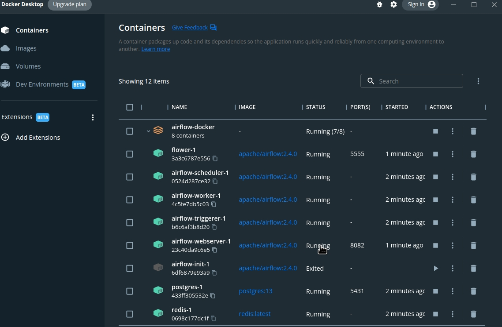
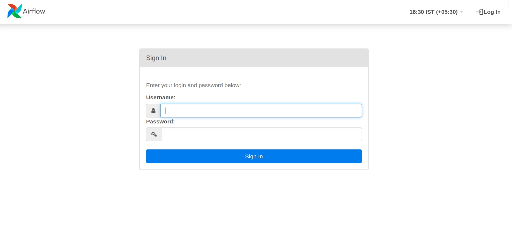

# Airflow Installation Instructions using Docker Linux/Windows

This Repository contains the details and steps to install Airflow easily using docker and get started with airflow superfast.

## Steps to install Airflow using Docker

1. Download [Docker Desktop](https://www.docker.com/)

2. Make sure you are able to run Docker Engine.
    - For Windows make sure you are using WSL2 as backend for docker containers.

3. Make sure you give docker atleast 4GB Memory so you will not get airflow less memory error.
    

    You can change the location of the docker images to save space in root directory.


4. [For Linux] Make sure at the File Sharing option you add the directory where you have docker-compose.yaml file stored.
    

5. 1.2. **[IMPORTANT]** IF you are using LINUX, please go ahead and run this command to get set UID, otherwise you will get File Persmission Error, and you will not be able to write dags.
    - ``` bash
            echo -e "AIRFLOW_UID=$(id -u)" > .env
        ```
    This command will set the user id, This is required only in Linux.

## After you have docker installed and configuration is complete:

1. To store your dags, logs and plugins you need to create three directories which can be made using this command:

    **(This step is optional, as the airflow-init-once.sh creates the directories on its own)**
    - ```bash 
        mkdir -p ./dags ./plugins ./logs
        ```
    - `dags` directory will contain your dags that you create.
    - `logs` directory will contain logs.
    - `plugins` directory will contain your external plugins if you have any.
    - These directories are linked to docker containers directories which are mentioned in `x-airflow-common:` service under `volumes`. You can add your own directories if you wish to.


2. Run `1.airflow-init-once.sh`
    - Run this file only once.
    - After you run this script, you will see lots of output in the terminal, once that is complete and you see `database created, please run 2.create-airflow-containers-once.sh to start your airflow instance`
    - To check the output, Open Docker Desktop, you will your newly created airflow container, click on `airflow-init-1` and you will be able to see the logs. Once it has done its job and exited successfully only then proceed to next steps. 

If you are not able scripts, please do `chmod +x *.sh` in terminal, this command will give execution permission to scripts.

#### ONLY PROCEED TO NEXT STEPS WHEN THE airflow-init-1 is complete.


3. After you get successful message from initialized database, run `create-airflow-containers-once.sh`
    - This command will take **some time** if you are running it for the first time as it will download and install all the required images.
    - Also RUN this file only once, as if you run it again and again, it will create new containers from scratch everytime you run this file, overwriting the pervious ones. Which may lead to data loss.

4. After the creation of containers is complete, in your Docker Dashboard you should be able to see something like this:

    

    - The `airflow-init-1` will always be in exited state as it runs only once to initialize the database, so don't worry about that.

5. After the containers have started, you can visit `localhost:8082` (Airflow Web-UI) and `localhost:5555` (Celery UI). It might take some time to turn on so be patient.
    - You will see this login UI.
    - User `airflow` Password `airflow`
    - By default examples have been set to 'false', you can turn them on in `docker-compose.yaml` by setting   `AIRFLOW__CORE__LOAD_EXAMPLES: 'true'`

    

6. Congratulations, you have successfully installed airflow in your machine using docker. 

7. To stop the the containers, simply run the `stop-airflow.sh` file and it will mercifully stop the containers using SIGTERM signal to containers.

# IMPORTANT After Installation Instructions

1. If you are getting AIRFLOW_UID not set Warning, you can simply ignore it, but if you want to get rid of it, simply create a `.env` file where `docker-compose.yaml` is present and set `AIRFLOW_UID=50000`. I have provided the file by default. 

2. **[IMPORTANT]** Whenever next time you want to start your container, simply run the `start-airflow.sh` file which contains the start command for already created containers and will not overwrite the previous ones.

3. If you wish to increase your airflow workers, you can do that by using the following command:
    - ``` bash
        docker compose --profile flower  up -d --scale airflow-worker=<number of worker you want>
        ```

    - Example if you want 3 workers and 1 master you can run the following command:
        ```bash
        docker compose --profile flower  up -d --scale airflow-worker=3
        ```
        Use this command only once, in future if you wish to increase your workers simply increase the airflow-woker argument and after it is done, you can use `start-airflow.sh` file to normally start your containers. 
